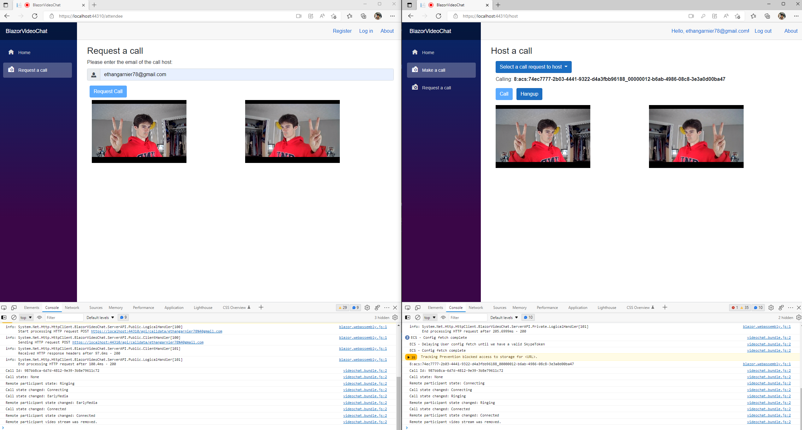

# Blazor Video Chat
---
A hosted Blazor Web Assembly app which utilizes Microsoft's Azure Communication Services to provide video calling. This repo serves as a learning experience, and will follow this [blog post](https://blazorhelpwebsite.com/ViewBlogPost/52) closely.
 

I see that my repo has been linked from the above mentioned blog post. As of July 2022 this repo is being worked on daily. I will do my best to continue the work that the author Michael Washington achieved in their article.

Author: Ethan Garnier 
